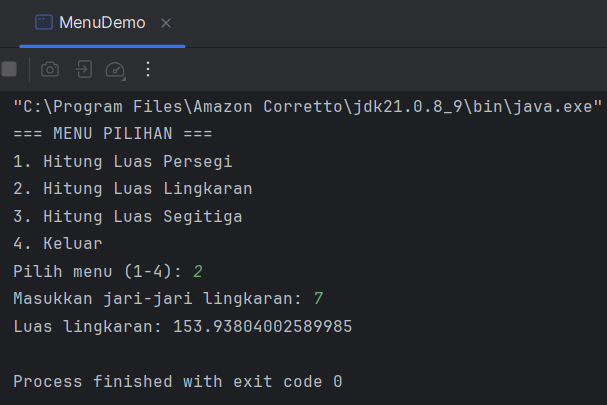

# Laporan Modul 2: Dasar Pemrograman Java
**Mata Kuliah:** Praktikum Pemrograman Berorientasi Objek  

**Nama:** Muhammad Fauzan

**NIM:** 2024573010124

**Kelas:** Teknik Informatika - 2E

---
# 1. Abstrak

Laporan ini mendokumentasikan hasil praktikum Modul 2 mengenai dasar-dasar pemrograman Java. 
Praktikum ini mencakup implementasi konsep-konsep fundamental seperti deklarasi variabel dan tipe data, 
penggunaan class `Scanner` untuk menangani input dan output, serta penerapan struktur kontrol. 
Struktur kontrol yang dibahas meliputi logika percabangan menggunakan `if-else` dan `switch-case`, serta berbagai jenis perulangan seperti `for`, `while`, dan `do-while`. 
Tujuan dari laporan ini adalah untuk menganalisis setiap kode program, memahami alur eksekusinya, 
dan menyajikan hasil yang didapatkan untuk menunjukkan pemahaman terhadap materi yang telah dipelajari.

---
# 2. Praktikum
## Praktikum 1 - Variabel Dan Tipe Data
Java memiliki dua kategori tipe data:

Tipe Data Primitif:
    
    1. byte: 8-bit signed integer (-128 to 127)

    2. short: 16-bit signed integer (-32,768 to 32,767)

    3. int: 32-bit signed integer (-2,147,483,648 to 2,147,483,647)

    4. long: 64-bit signed integer

    4. float: 32-bit IEEE 754 floating point

    4. double: 64-bit IEEE 754 floating point

    5. boolean: true atau false

    6. char: 16-bit Unicode character

### Tipe Data Reference
    String, Array, Object, dll.

### Aturan Penamaan Variabel
    1. Dimulai dengan huruf, underscore (_), atau dollar sign ($)

    2. Tidak boleh dimulai dengan angka

    3. Case sensitive

    4. Tidak boleh menggunakan keyword Java
### Prasyarat
1. Buat sebuah package baru dengan nama `modul_2` di dalam folder `src`

### Langkah-langkah Praktikum
Langkah 1:Buat file baru dengan nama `VariabelDemo.java`
Ketik kode berikut:

#### Screenshoot Hasil

#### Analisa dan Pembahasan
    Pada program VariabelDemo.java, terdapat 
    beberapa konsep dasar pemrograman 
    Java yang didemonstrasikan:

    Deklarasi dan Penggunaan Variabel: Program ini berhasil mendeklarasikan 
                                        variabel dengan berbagai tipe data primitif seperti int untuk bilangan bulat (umur)
                                        double untuk bilangan desimal (tinggi), char untuk satu karakter (grade)
                                        dan boolean untuk nilai kebenaran (true/false). Selain itu, digunakan juga tipe data reference yaitu String untuk menyimpan kumpulan karakter (nama). 
                                        Semua variabel berhasil diinisialisasi dan nilainya ditampilkan ke konsol, menunjukkan pemahaman yang benar tentang cara kerja variabel.

    Operasi Aritmatika: Bagian kedua dari kode mendemonstrasikan operasi aritmatika dasar.
                        Operasi seperti penjumlahan, pengurangan, dan perkalian berjalan seperti yang diharapkan.
                        Pada operasi pembagian (a / b atau 7 / 4) , hasilnya adalah 1. 
                        Ini terjadi karena kedua variabel (a dan b) adalah tipe int
                        sehingga Java melakukan pembagian integer yang hasilnya akan dibulatkan ke bawah (bagian desimal dihilangkan), bukan 1.75.
                        Operasi modulus (a % b) berhasil menunjukkan sisa bagi dari 7 / 4, yaitu 3.

    Casting Tipe Data: Explicit Casting (Narrowing): Pada baris int nilaiInt = (int) nilaiDouble;
                       terjadi konversi tipe data secara eksplisit dari double ke int. 
                       Proses ini "memaksa" nilai double 9.8 menjadi int, yang menyebabkan hilangnya bagian desimal
                       sehingga nilaiInt berisi 9. Ini menunjukkan bahwa casting dari tipe data yang lebih besar ke yang 
                       lebih kecil dapat menyebabkan kehilangan informasi.
   
    Automatic Promotion (Widening): Pada operasi byteVar + shortVar, Java secara otomatis mempromosikan tipe data byte dan short 
                                    menjadi int sebelum melakukan penjumlahan. Oleh karena itu, variabel hasil harus bertipe int 
                                    untuk menampung hasilnya. Ini adalah mekanisme keamanan di Java untuk mencegah kehilangan 
                                    data saat operasi dilakukan pada tipe data yang lebih kecil.

Secara keseluruhan, kode ini dengan jelas dan efektif menunjukkan konsep-konsep fundamental dalam Java, mulai dari penggunaan variabel, operasi dasar, hingga mekanisme konversi tipe data.

---
## Praktikum 2 - Input, Output dan Scanner
## Dasar Teori
Untuk membaca input dari pengguna dalam Java, kita menggunakan class Scanner yang terdapat dalam package `java.util`. Scanner menyediakan berbagai method untuk membaca berbagai tipe data:
   
    1. nextInt(): membaca integer
    2. nextDouble(): membaca double
    3. nextLine(): membaca String (termasuk spasi)
    4. next(): membaca String (sampai spasi pertama)
    5. nextBoolean(): membaca boolean
## Langkah Praktikum
Langkah 1: Import dan Membuat Scanner
Buat file baru dengan nama `InputOutputDemo.java`
Ketik kode berikut:

### Screenshoot Hasil

### Analisa dan Pembahasan
Program `InputOutputDemo.java` ini mendemonstrasikan cara menerima masukan (input) dari pengguna melalui konsol dan menampilkannya kembali sebagai keluaran (output).
    
    Berikut adalah poin-poin analisis dari kode tersebut:
    
    1. Import Kelas Scanner: Baris pertama import [java.util.Scanner;] sangat penting. 
    Perintah ini memberitahu program untuk mengimpor atau menggunakan kelas Scanner yang merupakan bagian dari pustaka java.util. 
    Tanpa baris ini, program tidak akan mengenali perintah untuk membuat objek Scanner.

    2. Membuat Objek Scanner: Kode Scanner input = new Scanner(System.in); berfungsi untuk membuat sebuah objek baru dari kelas Scanner. 
    Objek yang diberi nama input ini dihubungkan dengan sumber masukan standar, yaitu System.in (keyboard). 
    Mulai dari sini, objek input siap digunakan untuk "mendengarkan" dan menangkap data yang diketik oleh pengguna.

    3. Membaca Berbagai Tipe Data:
    [1] input.nextLine(): Metode ini digunakan untuk membaca masukan berupa String atau teks hingga pengguna menekan tombol Enter. 
    Metode ini mampu membaca seluruh baris, termasuk spasi.

    [2] input.nextInt(): Digunakan khusus untuk membaca masukan berupa bilangan bulat (int). 
    Metode ini akan berhenti membaca saat menemukan karakter yang bukan angka.

    [3] input.nextDouble(): Serupa dengan nextInt(), metode ini digunakan untuk membaca masukan berupa bilangan desimal (double).

    4. Menampilkan Output: Setelah semua data diterima dan disimpan dalam 
    variabel (nama, umur, tinggi), program menggunakan System.out.println() untuk menampilkan kembali data tersebut ke konsol dengan format yang lebih rapi dan informatif.

    5. Menutup Scanner: Baris input.close(); adalah praktik yang baik dalam pemrograman. 
    Perintah ini berfungsi untuk menutup objek Scanner setelah selesai digunakan. 
    Hal ini penting untuk melepaskan sumber daya sistem yang telah digunakan oleh Scanner
    sehingga mencegah terjadinya resource leak (kebocoran sumber daya).

**Secara keseluruhan, program ini secara efektif menunjukkan 
alur kerja dasar interaksi dengan pengguna di Java: menginisialisasi Scanner
menggunakan metode yang sesuai untuk membaca tipe data yang berbeda,
dan terakhir menutup Scanner untuk menjaga kebersihan kode dan sumber daya.**

---
## Praktikum 3 - Struktur Control: Percabangan
## Dasar Teori
Struktur kontrol percabangan digunakan untuk membuat keputusan dalam program. Java menyediakan beberapa statement percabangan:

1. `If Statement`

        if (kondisi) {
            // kode yang dijalankan jika kondisi true
        }

2. `If-Else Statement`

        if (kondisi) {
             // kode jika kondisi true
        } else {
            // kode jika kondisi false
        }

3. `If-Else If-Else Statement`

        if (kondisi1) {
             // kode jika kondisi1 true
        } else if (kondisi2) {
            // kode jika kondisi2 true
        } else {
            // kode jika semua kondisi false
        }
      
4. `Switch Statement`

        switch (variabel) {
            case nilai1:
                // kode
               break;
        case nilai2:
           // kode
           break;
        default:
            // kode default
        }
## Langkah Praktikum
Langkah 1: Program Penentu Grade
1. Buat file baru dengan nama `GradeDemo.java`
2. Implementasikan kode berikut:
   
   

Langkah 2: Program Menu dengan Switch
1. Buat file baru dengan nama `MenuDemo.java`
2. Implementasikan kode berikut:
   
   

Langkah 3: Program Nested If
1. Buat file baru dengan nama `NestedIfDemo.java`
2. Implementasikan program untuk menentukan kategori usia:
   

## Screenshoot Hasil
1. Output `GradeDemo.java`

    `Grade A`
   
    `Grade B`
   
    `Grade C`
   
    `Grade D`
   
    `Grade E`
   

2. Output `MenuDemo.java`

    `Luas Persegi`
   
    `Luas Lingkaran`
   
    `Luas Segitiga`
   
    `Menu Keluar`
   

3. Output `NestedIf`

    `Bayi`
   
    `Balita`
   
    `Anak-Anak`
   
    `Remaja`
   
    `Dewasa`
   
    `Lansia`
   

## Analisa dan Pembahasan
1. Program Penentu Grade `GradeDemo.java`
   
Program `GradeDemo.java` adalah contoh klasik penggunaan struktur 
kontrol percabangan `if-else` `if-else` untuk menyelesaikan masalah umum, 
yaitu konversi nilai numerik menjadi nilai huruf (grade). 
Struktur ini sangat penting untuk membuat program yang dapat mengambil 
keputusan berdasarkan serangkaian kondisi yang saling eksklusif.

    Alur Logika Program
    1. Input Pengguna: Program pertama-tama meminta pengguna untuk 
                       memasukkan sebuah nilai numerik (antara 0-100) menggunakan objek Scanner. 
                       Nilai ini kemudian disimpan dalam variabel integer nilai.

    2. Struktur Percabangan [if-else] [if-else]: Ini adalah inti dari program. Program akan 
                                                 mengevaluasi serangkaian kondisi 
                                                 secara berurutan dari atas ke bawah:
                                                    a. if (nilai >= 85): Kondisi pertama yang dicek. 
                                                                         Jika nilai adalah 85 atau lebih, blok kode ini akan dieksekusi 
                                                                         (grade diatur ke 'A', keterangan ke "Excellent"), 
                                                                          dan seluruh sisa dari struktur if-else if-else akan dilewati.

                                                    b. else if (nilai > 75): Jika kondisi pertama false (artinya nilai < 85), 
                                                                             maka kondisi ini akan dicek. Ini akan true untuk nilai dari 76 hingga 84. 
                                                                             Jika true, blok ini dieksekusi, dan sisanya dilewati.

                                                    c. else if (nilai > 65): Jika dua kondisi sebelumnya false (artinya nilai <= 75), 
                                                                             kondisi ini dicek. Ini berlaku untuk nilai dari 66 hingga 75.

                                                    d. else if (nilai > 55): Jika semua kondisi di atas false (artinya nilai <= 65), 
                                                                             kondisi ini akan dicek. Berlaku untuk nilai dari 56 hingga 65.

                                                    e. else: Ini adalah blok "penampung" atau catch-all. 
                                                             Jika tidak ada satupun kondisi di atas yang terpenuhi (artinya nilai adalah 55 atau kurang), 
                                                             maka blok kode ini yang akan dieksekusi secara otomatis.

    3. Output: Setelah salah satu blok di dalam struktur percabangan dieksekusi dan variabel 
               grade serta keterangan mendapatkan nilainya, program akan mencetak hasil akhir ke konsol.

**Poin Penting**

1. Urutan Kondisi: Urutan pengecekan kondisi sangat penting dalam `if-else` `if-else`. 
                   Kondisi harus diurutkan dari yang paling spesifik/tinggi ke yang paling umum/rendah. 
                   Jika urutannya dibalik (misalnya, if (nilai > 55) ditaruh di paling atas), 
                   maka nilai seperti 90 akan langsung memenuhi kondisi pertama dan mendapatkan grade 'D', yang tentunya salah.

2. Efisiensi: Struktur ini efisien karena pengecekan akan berhenti begitu salah satu kondisi terpenuhi. 
              Program tidak perlu memeriksa semua kemungkinan.

Secara keseluruhan, program ini secara efektif menunjukkan bagaimana `if-else` `if-else` digunakan untuk memetakan rentang 
nilai ke dalam kategori-kategori yang berbeda, sebuah pola logika yang sangat umum dalam pemrograman.

2. Program Menu dengan Switch `MenuDemo.java`

Program `MenuDemo.java` mendemonstrasikan penggunaan struktur kontrol percabangan `switch-case`. 
Struktur ini merupakan alternatif yang sering kali lebih bersih dan mudah dibaca dibandingkan `if-else` `if-else` 
ketika program harus memilih satu di antara banyak opsi berdasarkan nilai dari sebuah variabel tunggal.

    Alur Logika Program
    1. Input Pengguna: Program dimulai dengan menampilkan serangkaian menu kepada pengguna. 
                       Kemudian, menggunakan objek [Scanner], program meminta pengguna untuk 
                       memasukkan pilihan mereka (sebuah angka integer).

    2. Struktur switch(pilihan): Ini adalah inti dari program. Nilai dari variabel pilihan akan dievaluasi.
                                 Note: Program akan mencari [case] yang labelnya cocok dengan nilai [pilihan]. Misalnya, jika pengguna memasukkan [2], program akan langsung melompat ke blok [case 2:].

    3. Eksekusi case:
            a. [case 1], [case 2], [case 3]: Masing-masing blok ini akan meminta input tambahan yang relevan 
               (sisi, jari-jari, atau alas dan tinggi), melakukan perhitungan matematika yang sesuai, dan kemudian mencetak hasilnya.

            b. [case 4]: Blok ini hanya menampilkan pesan terima kasih, menandakan opsi untuk keluar dari program.

            c. [default]: Jika nilai [pilihan] yang dimasukkan pengguna tidak cocok dengan [case] manapun 
                          (misalnya, pengguna memasukkan [5] atau [0]), maka blok [default] akan dieksekusi, 
                          yang memberitahu pengguna bahwa pilihan mereka tidak valid.

            d. Peran [break;]: Pernyataan [break;] di akhir setiap case sangat krusial. Fungsinya adalah untuk 
                               menghentikan eksekusi di dalam [switch] dan keluar dari blok tersebut. 
                               Tanpa [break], program akan "jatuh" (fall-through) dan melanjutkan eksekusi ke [case] 
                               berikutnya secara berurutan hingga menemukan [break] atau akhir dari blok [switch].

**Poin Penting**

    1. Keterbacaan: Untuk menu dengan banyak pilihan yang jelas seperti ini, 
                    [switch-case] sering dianggap lebih rapi dan lebih mudah 
                    dibaca daripada struktur [if-else] [if-else] yang panjang. 
                    Logikanya langsung memetakan satu nilai ke satu aksi.

    2. atasan Tipe Data: [switch] di Java dapat digunakan dengan tipe data primitif 
                          seperti [byte], [short], [char], dan [int]. Sejak Java 7, 
                          [switch] juga mendukung tipe data [String].

    3. Kapan Menggunakan [switch] vs [if-else]:
        a. Gunakan [switch-case] ketika Anda membandingkan satu variabel dengan serangkaian 
           nilai konstan yang diskrit (misalnya, 1, 2, 3, 'A', 'B', "YA").
        b. Gunakan [if-else] [if-else] ketika Anda perlu mengevaluasi kondisi yang lebih kompleks, 
           seperti rentang nilai ([nilai > 85]) atau beberapa variabel yang berbeda dalam satu kondisi.

Secara keseluruhan, program ini adalah contoh sempurna yang menunjukkan kekuatan dan kejelasan `switch-case` 
untuk mengimplementasikan sistem menu yang terstruktur.

3. Program Nested If `NestedIfDemo.java`

Program `NestedIfDemo.java` mendemonstrasikan konsep nested `if`, yaitu sebuah struktur `if` yang 
berada di dalam struktur `if` lainnya. Teknik ini sangat berguna untuk melakukan serangkaian pengecekan 
kondisi yang bertingkat, di mana sebuah kondisi baru diperiksa hanya jika kondisi sebelumnya sudah terpenuhi.

    Alur Logika Program
    Program ini bertujuan untuk mengkategorikan seseorang berdasarkan umurnya. 
    Logikanya dibagi menjadi dua level pengecekan:

    Level 1: Validasi Input (Outer if)
    if (umur >= 0) {
        // ... kode pengecekan kategori ...
    } else {
        System.out.println("Umur tidak valid!");
    }

    a. Ini adalah pengecekan pertama dan yang paling utama. 
       Program memastikan bahwa umur yang dimasukkan oleh pengguna adalah nilai yang valid (tidak negatif).

    b. Jika umur lebih besar dari atau sama dengan 0, 
       program akan melanjutkan ke blok if bagian dalam untuk melakukan kategorisasi.

    c. Jika umur negatif, program akan langsung masuk ke blok else 
       dan menampilkan pesan error, tanpa perlu melakukan pengecekan kategori lebih lanjut.

    Level 2: Kategorisasi Umur (Inner if-else if-else)
    if (umur <= 2) {
        System.out.println("Kategori: Bayi");
    } else if (umur <= 5) {
        System.out.println("Kategori: Balita");
    } // ... dan seterusnya

    a. Blok ini hanya akan dieksekusi jika umur sudah dipastikan valid (positif) oleh outer if.

    b. Di sini, program menggunakan struktur [if-else] [if-else] standar untuk 
       menentukan kategori yang sesuai berdasarkan rentang umur. 
       Pengecekan dilakukan secara berurutan dari umur termuda hingga tertua.

**Poin Penting**
1. Pemisahan Logika: Keuntungan utama dari nested if dalam 
                     contoh ini adalah pemisahan yang jelas antara logika validasi data dan logika pemrosesan data. 
                     Hal ini membuat kode lebih terstruktur dan mudah dibaca. Kita tidak mencampuradukkan pengecekan 
                     umur valid dengan pengecekan kategori.

2. Efisiensi: Dengan memeriksa validitas input terlebih dahulu, program menghindari pemrosesan yang tidak perlu. 
              Jika input tidak valid, program bisa langsung berhenti dan memberitahu pengguna, menghemat waktu eksekusi.

3. Alternatif: Meskipun nested if di sini sangat efektif, masalah ini juga bisa diselesaikan tanpa nesting, 
               misalnya dengan menggabungkan kondisi menggunakan operator logika `&&` (DAN). Namun, pendekatan 
               nested if seringkali lebih merefleksikan alur pikir manusia: "Pertama, pastikan datanya benar. 
               Kemudian, baru kita proses datanya."

Secara keseluruhan, `NestedIfDemo.java` adalah contoh yang sangat baik untuk menunjukkan 
bagaimana nested if dapat digunakan untuk membangun alur program yang logis, aman, dan terstruktur.

---
## Praktikum 4 - Struktur Control: Perulangan
## Dasar Teori
Perulangan (loop) digunakan untuk mengulang eksekusi kode tertentu.
Java menyediakan tiga jenis perulangan:

    For Loop
    for (inisialisasi; kondisi; increment/decrement) {
        // kode yang diulang
    }

    While Loop
    while (kondisi) {
        // kode yang diulang
    }
    Do-While Loop
    do {
        // kode yang diulang
    } while (kondisi);

## Langkah Praktikum
Langkah 1: Perulangan For
1. Buat file baru dengan nama `ForLoopDemo.java`
2. Implementasikan berbagai contoh ForLoop:
   

Langkah 2: Perulangan While dan Do-While
1. Buat file baru dengan nama `WhileLoopDemo.java`
2. Implementasikan contoh while dan do-while:
   
   

Langkah 3: Nested Loop (Perulangan Bersarang)
1. Buat file baru dengan nama `NestedLoopDemo.java`
2. Implementasikan contoh nested loop:
   
## Screenshoot Hasil
1. Output `ForLoopDemo.java`
   

2. Output Tebak Angka Dan Menu Pada Program `WhileLoopDemo.java`
   `Tebak Angka:`
   
   `Menu Pilihan:`
   

3. Output `NestedLoopDemo.java`
   
## Analisa dan Pembahasan
1. `For Loop`

Program `ForLoopDemo.java` memberikan demonstrasi yang sangat baik
mengenai fleksibilitas dan kekuatan dari struktur kontrol perulangan for dalam bahasa Java.
Setiap contoh di dalam kode ini menyoroti cara yang berbeda untuk mengontrol alur perulangan.
Berikut adalah analisis rincinya:

Struktur dasar dari `for loop` terdiri dari tiga bagian utama yang dievaluasi secara berurutan:
`for (inisialisasi; kondisi; pembaruan)`

    Inisialisasi: Dieksekusi hanya sekali di awal perulangan. 
                  Biasanya digunakan untuk mendeklarasikan 
                  dan memberi nilai awal pada variabel kontrol (misalnya, [int i = 1]).

    Kondisi: Dievaluasi sebelum setiap iterasi. 
             Jika kondisi bernilai true, blok kode di dalam perulangan akan dieksekusi. 
             Jika false, perulangan akan berhenti.

    Pembaruan (Update): Dieksekusi di akhir setiap iterasi. 
                        Biasanya digunakan untuk mengubah nilai variabel kontrol (misalnya, [i++, i += 2, i--]).

Analisis Setiap Contoh:
Contoh 1: Menampilkan Angka 1-10

    for (int i = 1; i <= 10; i++) { ... }
    Pembahasan:
    1. Inisialisasi: int i = 1 memulai variabel i dari angka 1.
    2. Kondisi: i <= 10 memastikan perulangan terus berjalan selama nilai i kurang dari atau sama dengan 10.
    3. Pembaruan: i++ menaikkan nilai i sebesar 1 setiap kali iterasi selesai.
                  Ini adalah implementasi for loop yang paling umum, 
                  yaitu untuk melakukan iterasi sejumlah kali yang sudah ditentukan dengan penambahan nilai secara berurutan (increment).

Contoh 2: Menampilkan Angka Genap 2-20

    for (int i = 2; i <= 20; i += 2) { ... }
    Pembahasan:
    1. Inisialisasi: [int i = 2] memulai perulangan dari angka genap pertama yang diinginkan.
    2. Kondisi: [i <= 20] menghentikan perulangan setelah [i] mencapai 20.
    3. Pembaruan: [i += 2] adalah kunci dari contoh ini. 
              Alih-alih menaikkan nilai sebesar 1, 
              pembaruan ini menaikkan [i] sebesar 2 pada setiap iterasi. 
              Ini adalah cara yang efisien untuk melompati angka 
              dan hanya memproses nilai yang diinginkan (dalam hal ini, angka genap) 
              tanpa perlu menggunakan pernyataan [if] di dalam loop.

Contoh 3: Countdown

    for (int i = 10; i >= 1; i--) { ... }
    Pembahasan:
    1. Inisialisasi: `int i = 10 memulai variabel kontrol dari nilai tertinggi.
    2. Kondisi: i >= 1 membuat perulangan berjalan selama i lebih besar dari atau sama dengan 1.
    3. Pembaruan: i-- mengurangi (decrement) nilai i sebesar 1 setiap iterasi.
    Contoh ini menunjukkan bahwa for loop tidak hanya bisa berjalan "maju" (menaik), 
    tetapi juga bisa berjalan "mundur" (menurun) dengan mengubah kondisi dan ekspresi pembaruan.

Contoh 4: Tabel Perkalian 5

    for (int i = 1; i <= 10; i++) {
        System.out.println("5 x " + i + " = " + (5 * i));
    }

    Contoh ini menggunakan [for loop] standar seperti pada Contoh 1. 
    Namun, yang menarik di sini adalah bagaimana variabel kontrol [i] digunakan di dalam blok perulangan. 
    Nilai [i] yang berubah-ubah dari 1 hingga 10 pada setiap iterasi tidak hanya dicetak, 
    tetapi juga digunakan sebagai bagian dari operasi matematika [(5 * i)].
    Ini menunjukkan bahwa variabel kontrol sangat berguna untuk melakukan perhitungan 
    atau mengakses data secara berulang dengan nilai yang dinamis.

**Secara keseluruhan, program ini berhasil menunjukkan bahwa dengan memanipulasi tiga komponen inti dari `for loop`,
kita dapat menciptakan berbagai macam pola perulangan untuk menyelesaikan masalah yang berbeda,
mulai dari iterasi sederhana hingga perhitungan yang lebih kompleks.**

2. `While Loop`

Program `WhileLoopDemo.java` mendemonstrasikan dua jenis perulangan lain dalam Java
yang kondisinya tidak terikat oleh hitungan, yaitu `while` dan `do-while`.
Kedua loop ini sangat berguna ketika jumlah iterasi
tidak diketahui sebelumnya dan bergantung pada kondisi yang dinamis.

    Perbedaan Mendasar `while` dan `do-while`
    `while loop`: Melakukan pengecekan kondisi di awal. Jika kondisi pertama kali bernilai `false`, 
                  maka blok kode di dalamnya tidak akan pernah dieksekusi sama sekali.

    `do-while loop`: Melakukan pengecekan kondisi di akhir. Ini menjamin bahwa blok kode 
                     di dalamnya akan dieksekusi minimal satu kali, terlepas dari kondisi awalnya.

**Analisis Setiap Contoh:**
Contoh 1: `while Loop` - Game Tebak Angka

    while (tebakan != angkaRahasia) {
        // ... kode untuk menebak ...
    }
Program ini mensimulasikan permainan tebak angka sederhana.

    Kondisi: [tebakan != angkaRahasia]. Perulangan akan terus berjalan 
             selama variabel [tebakan] tidak sama dengan [angkaRahasia].

    Logika:

    1. Di awal, [tebakan] diinisialisasi dengan nilai [0], 
       sedangkan [angkaRahasia] adalah [7]. Karena [0 != 7] bernilai [true], perulangan dimulai.

    2. Di dalam loop, program meminta pengguna memasukkan tebakan. 
       [Nilai] tebakan akan terus diperbarui pada setiap iterasi.

    3. Terdapat struktur [if-else] [if-else] untuk memberikan petunjuk kepada pengguna 
       apakah tebakan mereka terlalu kecil, terlalu besar, atau sudah benar.

    4. Perulangan ini akan berhenti hanya jika pengguna berhasil menebak angka dengan benar, 
       yang menyebabkan kondisi [tebakan != angkaRahasia] menjadi [false].

    Penggunaan Ideal: [while loop] sangat cocok untuk kasus ini 
                      karena kita tidak tahu berapa kali pengguna akan mencoba menebak. 
                      Perulangan berjalan berdasarkan kondisi yang bergantung pada input pengguna.

Contoh 2: `do-while Loop` - Tampilan Menu

     do {
        // ... tampilkan menu dan proses pilihan ...
    } while (pilihan != 3);

Program ini mensimulasikan sistem menu interaktif
di mana pengguna bisa memilih beberapa opsi.

    Logika:
    1. Saat program pertama kali masuk ke blok [do], 
       menu langsung ditampilkan kepada pengguna, dan program meminta input pilihan. 
       Ini terjadi sebelum kondisi apapun dicek.

    2. Pilihan pengguna kemudian diproses menggunakan struktur [switch-case].

    3. Setelah satu aksi selesai (misalnya, menampilkan pesan atau menghitung faktorial), 
       program mencapai akhir blok dan baru mengecek kondisi [while (pilihan != 3)].

    4. Jika pengguna memilih 1 atau 2 (atau pilihan tidak valid), 
       kondisi pilihan [!= 3] akan bernilai [true], 
       dan perulangan akan kembali ke awal untuk menampilkan menu lagi.

    5. Jika pengguna memilih 3, [kondisi pilihan != 3] menjadi [false], dan perulangan pun berhenti.

    Penggunaan Ideal: [do-while] loop adalah pilihan yang sempurna untuk sistem menu seperti ini. 
    Alasannya adalah menu harus ditampilkan terlebih dahulu setidaknya satu kali 
    agar pengguna tahu opsi apa yang tersedia sebelum mereka bisa membuat pilihan.

Secara keseluruhan, kode ini dengan jelas membedakan kasus penggunaan ideal untuk
`while`(ketika eksekusi awal belum tentu diperlukan)
dan `do-while` (ketika eksekusi minimal satu kali adalah sebuah keharusan).

3. `NestedLoop`

Program `NestedLoopDemo.java` menampilkan konsep perulangan bersarang (nested loop),
di mana sebuah struktur perulangan (`for`, `while`, atau `do-while`) ditempatkan di dalam perulangan lainnya.
Konsep ini sangat fundamental untuk memproses data dalam format dua dimensi
seperti matriks, tabel, atau untuk membuat pola visual.

    Struktur dasar dari nested loop adalah sebagai berikut:
    1. Outer Loop (Perulangan Luar): Mengontrol iterasi utama. Sering kali dianggap sebagai pengontrol "baris".
    2. Inner Loop (Perulangan Dalam): Berada di dalam outer loop. 
                                      Perulangan ini akan menyelesaikan seluruh siklus 
                                      iterasinya untuk setiap satu kali iterasi dari outer loop.Sering kali dianggap sebagai pengontrol "kolom".

Analisis Setiap Contoh:
Contoh 1: `Pola Bintang Segitiga`

    for (int i = 1; i <= 5; i++) {       // Outer loop (mengontrol baris)
        for (int j = 1; j <= i; j++) {   // Inner loop (mengontrol kolom)
        System.out.print("* ");
        }
        System.out.println();
    }

    1. Outer loop (i) berjalan dari 1 sampai 5. Ini menentukan bahwa akan ada 5 baris output.
    2. Inner loop (j) memiliki kondisi [j <= i]. Ini adalah kunci dari pola segitiga. 
       Jumlah kolom (bintang yang dicetak) di setiap baris bergantung pada nomor baris saat ini (i).
                            a. Saat i = 1, inner loop berjalan 1 kali (j=1). Output: *
                            b. Saat i = 2, inner loop berjalan 2 kali (j=1, j=2). Output: * *
                            c. Dan seterusnya hingga i = 5.

    3.[ System.out.println();] dieksekusi setelah inner loop selesai. 
                               Fungsinya adalah untuk membuat baris baru (newline) 
                               agar bintang-bintang di iterasi berikutnya tercetak di bawahnya.

Contoh 2: `Tabel Perkalian`

    for (int i = 1; i <= 5; i++) {
        for (int j = 1; j <= 5; j++) {
            System.out.printf("%3d ", (i * j));
        }
            System.out.println();
    }

    1. Outer loop (i) berjalan dari 1 sampai 5, merepresentasikan faktor pengali pertama.
    2. Inner loop (j) juga berjalan dari 1 sampai 5 untuk setiap iterasi [i], merepresentasikan faktor pengali kedua.
    3. Di dalam inner loop, hasil perkalian i * j dicetak. Ini menciptakan sebuah tabel 5x5.
    4. [System.out.printf("%3d ", ...)] digunakan untuk memformat output. [%3d] 
        artinya mencetak sebuah integer (d) dan memberinya ruang sebanyak 3 karakter. 
        Ini membuat angka-angka dalam tabel tersusun rapi dan lurus secara vertikal.

Contoh 3: `Pola Angka`

    for (int i = 1; i <= 4; i++) {
        for (int j = 1; j <= i; j++) {
            System.out.print(j + " ");
        }
        System.out.println();
    }

    1. Logika perulangan ini identik dengan Contoh 1 (Pola Bintang), di mana inner loop bergantung pada outer loop.
    2. Perbedaannya terletak pada apa yang dicetak. Alih-alih mencetak karakter statis seperti *, 
       program ini mencetak nilai dari variabel kontrol inner loop (j).
            a. Saat [i = 1], inner loop berjalan sekali, mencetak [j] yang bernilai 1. Output: [1]
            b. Saat [i = 2], inner loop berjalan dua kali, mencetak [j] yang bernilai 1, lalu 2. Output: [1 2]
            c. Dan seterusnya.

**Secara keseluruhan, nested loops adalah alat yang sangat kuat untuk menangani masalah
yang memiliki struktur berulang di dalam perulangan lain.
Kunci untuk memahaminya adalah dengan menelusuri alur eksekusi `outer loop` dan inner loop secara terpisah.**

---
## 3. Kesimpulan

Praktikum Modul 2 memberikan pemahaman mendalam mengenai fondasi dasar pemrograman Java. Melalui serangkaian latihan, 
praktikan telah berhasil mengimplementasikan konsep-konsep kunci yang menjadi pilar dalam pengembangan perangkat lunak. 
Konsep tersebut mencakup pemahaman tentang variabel dan tipe data untuk menyimpan informasi, penggunaan kelas `Scanner` 
untuk menciptakan program yang interaktif melalui input dan output, serta penerapan struktur kontrol untuk mengatur alur eksekusi program.

Struktur kontrol percabangan seperti `if-else` dan `switch-case` memungkinkan program untuk membuat keputusan logis, 
sementara struktur perulangan `for`, `while`, dan `do-while` memberikan kemampuan untuk menjalankan tugas-tugas repetitif secara efisien. 
Penguasaan materi-materi ini merupakan langkah esensial sebelum melangkah ke konsep yang lebih kompleks dalam pemrograman berorientasi objek.

---

## 5. Referensi
Modul 2 - Dasar Pemrograman Java — https://hackmd.io/@mohdrzu/B1DuPNNOgx

Java Tutorial - W3Schools — https://www.w3schools.com/java/

---